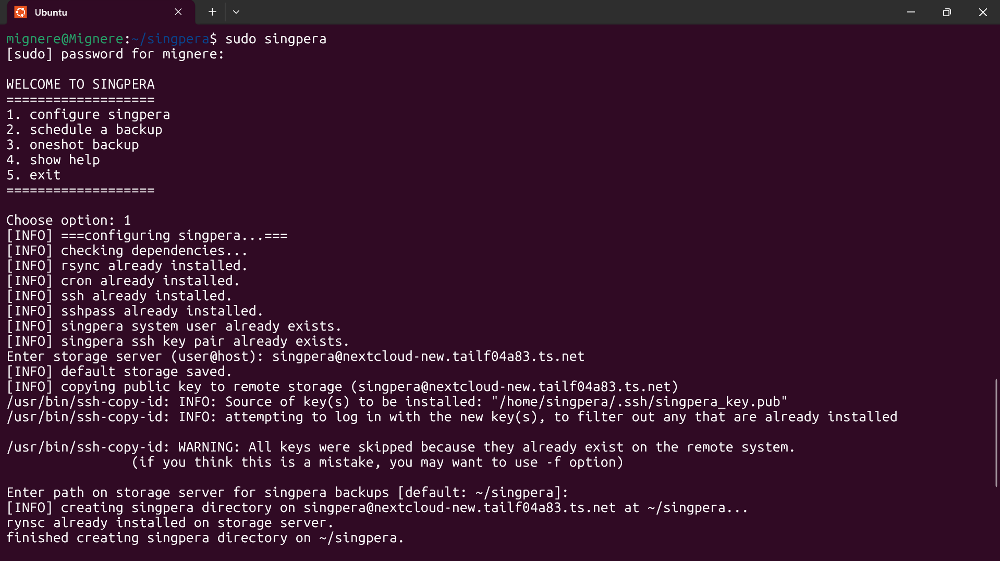
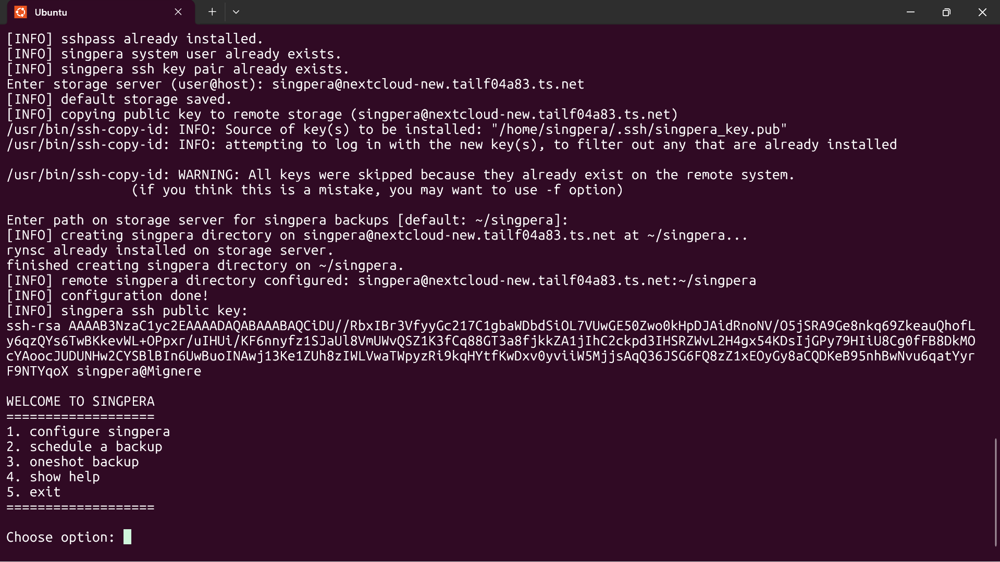
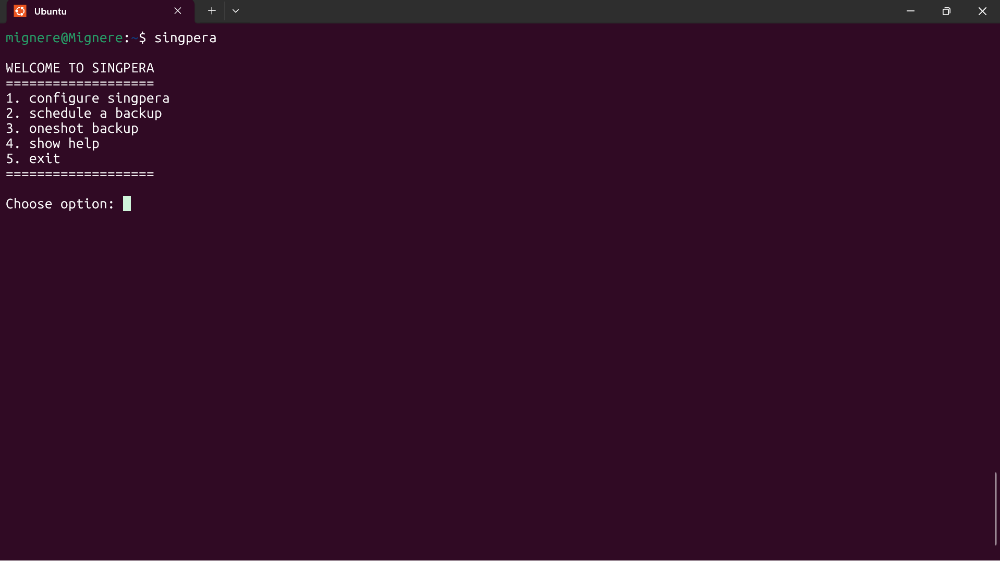
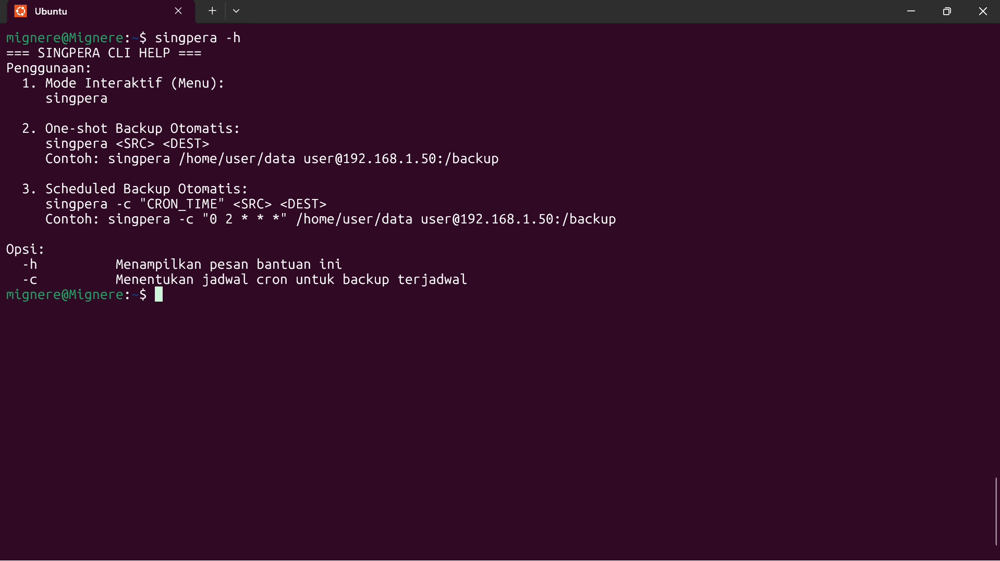
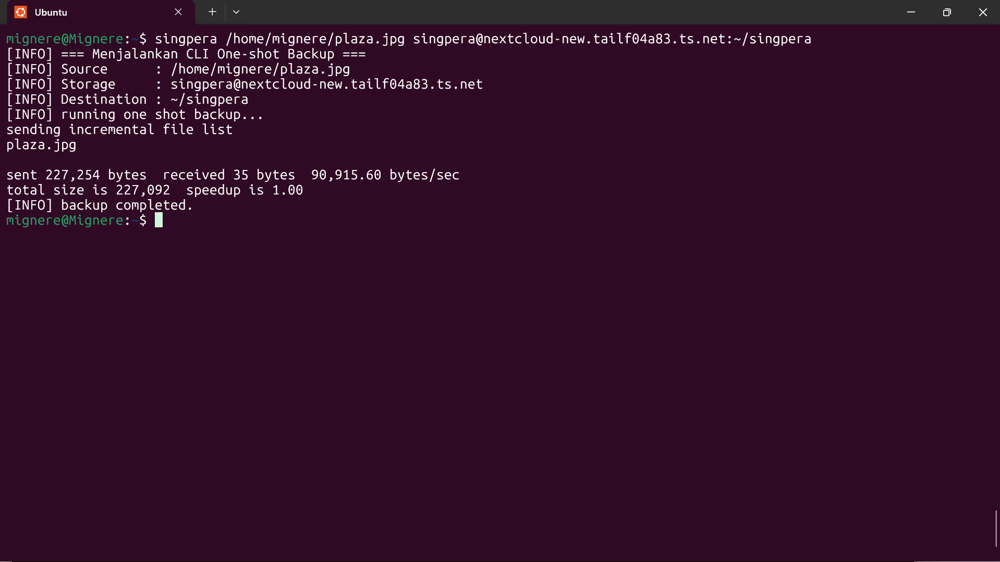
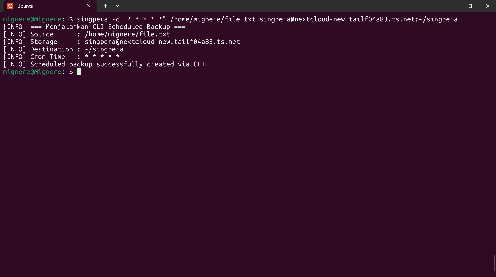
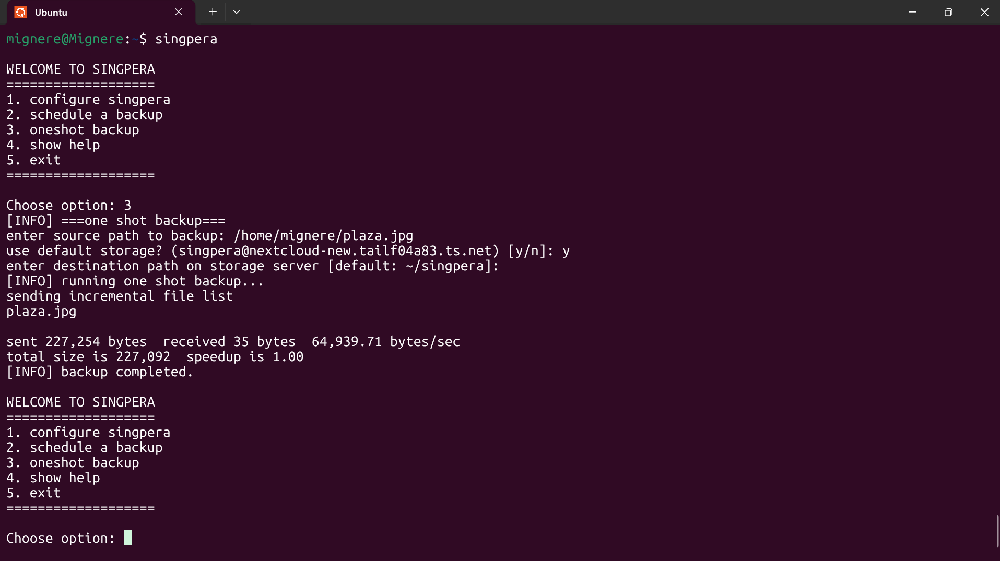
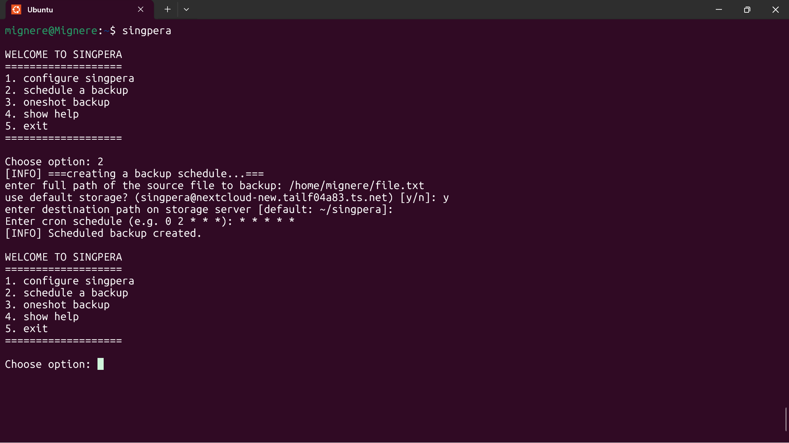

# SINGPERA
project mata kuliah sistem operasi kelompok 1: SINGPERA

## Anggota Kelompok:
1. Muhammad Hikmal Mutaqin (1519625005)
2. Faadhel Mubaarak (1519625012)
3. Muhammad Risqi Maulana (1519625032)
4. Bonita Zhafira Fitu M. (1519625035) 
5. Felisgi Mashinta (1519625038)
6. Fernando Iskandar Yusuf (1519625042)
7. Muhammad Yunus Setiaji (1519625043)
8. Nabila Nurfajriyasah (1519625045)
9. Annisa Asmarani Putri (1519625052)
10. Daffa Alfaridzi (1519625054)
11. Muhammad Rizqi Hazami (1519625064)
12. Krishna Dhikha Pratama (1519625070)

## Petunjuk instalasi
### 1. Download the source code  
```wget https://github.com/mignere/SINGPERA/archive/refs/heads/main.zip -O singpera.zip```
### 2. Unzip the source code  
```unzip singpera.zip```
### 3. Move singpera binary to system local binary directory  
```sudo mv singpera-MAIN/singpera /usr/local/bin/singpera```
### 4. test if the binary can be called globally  
```singpera -h```
### 5. configure singpera  
```sudo singpera```  
you will be prompted the details for:  
    1. storage server  
    2. path to be used on the storage server
  
example can be seen below: 

  
  

## Petunjuk Penggunaan
### 1. show main menu  
```singpera```  

### 2. show help menu  
```singpera -h```  

### 3. oneshot backup in cli
```singpera <SRC> <DEST>```  

### 4. scheduled backup in cli
```singpera -c "CRON_TIME" <SRC> <DEST>```  

### 5. oneshot backup in interactive mode
```singpera```  
choose option 3  
you will be prompted the details for:  
    1. source path of the file you wanted to backup  
    2. the storage server  
    3. the directory where backup files should be stored  

example can be seen below:  

### 6. scheduled backup in interactive mode
```singpera```  
choose option 2  
you will be prompted the details for:  
    1. source path of the file you wanted to backup  
    2. the storage server  
    3. the directory where backup files should be stored
    4. the cron time expression  

example can be seen below:  

